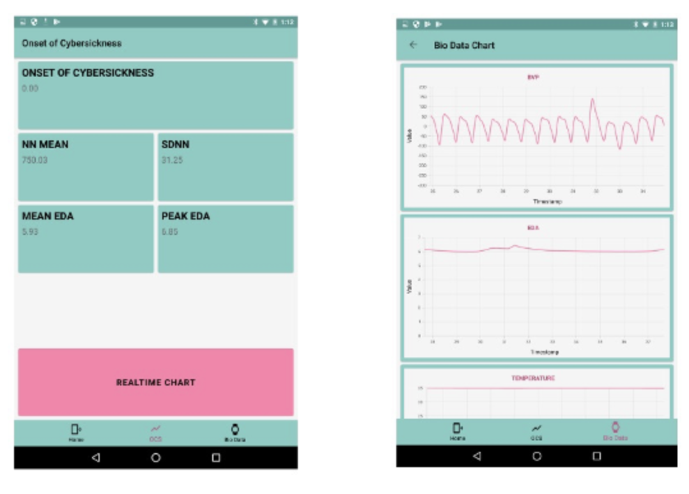

# Meeting Notes

Date: 17 March, 2022

Time: 09:00 \~ 10:30

Room: Dolphin

Present: Lead Programmer, Head of Design, Marketing Manager, Research Consultant, and Technical Writer.


**Summary:** The following notes provide a summary of the discussions regarding the feasibility of developing a new iOS and Android application for detecting cybersickness of persons enaged in Virtual Reality (VR) activities. A working prototype has been successfully designed for 'proof-of-concept' but further financial resources are required to develop a product which may be marketed to specialised medical VR users.

## Discussion

#### Purpose of the project

At present there is no single physiological measure to capture cybersickness, no established method to determine the severity of cybersickness, and the resultant analysis is often inaccessible to VR users who are not experts in studies in physiological and statistical analysis. It is therefore reasoned that due to such perceived cybersickness complexities, mainstream adoption of VR has not been as ubiquitous as expected. The development of a dedicated cybersickness application to detect the 'onset' of cybersickness is in progress. The application name is Cybatica.&#x20;

#### Research progress

**The Research Consultant** reported that progress of data collection and analyis has proved to be valid and reliable. After 2 controlled experiments involving 35 participants a reliable metric was calculated with valid statistical significance. The metric has been termed OCS (short for Onset of Cybersickness) and is currently in the process of being patented by the Marketing Manager. The metric is shown below.

* [ ] OCS = (a' + b' + c') \* 3.74&#x20;
  * [ ] determined from the following metrics recorded
*   [ ] OCS Nausea Score=a^'\* 9.54

    OCS Oculomotor Score=b^'\* 7.58

    OCS Disorientation Score=c^'\* 13.93

    a' = ∑\_(i=1)^n. proxy(Nausea Parameter)

    b' = ∑\_(i=1)^n. proxy(Oculomotor Parameter)

    c' = ∑\_(i=1)^n. proxy(Disorientation Parameter)

**The Lead Programmer** reported that the application has been developed using Apple XCode 11. The prototype is operational. A number of bugs need to be fixed. The application generates too much heat from the hardware (i.e., iPhone 13 Pro) when used for more than 5 minutes. However, the programmer has been re-assigned to another project due to funding for Cybatica has reached its current limit.&#x20;

**The Head of Design** illustrated the user-interface. See Figures 1 and 2 below. Further usability testing is required in order to determine the most effective way of projecting the cybersickness score quickly to the user.


**The Technical Writer** has started the supporting documentation with a description of the application and a procedure for medical personnel using the aplication.&#x20;

**The Marketing Manager** has acquired positive feedback on the application from the users testing the application, and supports the request for additional funding.

### Potential conflicts

* competitor working on a similar application
* medical biodata hardware manufacturers may bundle an application with their devices
* may not obtain medical approval
* may require liability insurance
* future iOS and Android updates may crash the application

### Action outcomes

1. All meeting attendees approved the continuing development of the Cybatica application.
2. **The Marketing Manager** will approach the Board of Directors to seek additional funding to develop Cybatica into a commercial product.
3. **The Marketing Manager** will create a cost-analysis to determine amount of funding to be requested.
4. The deadline for a decision is 31 March, 2022.&#x20;

##

