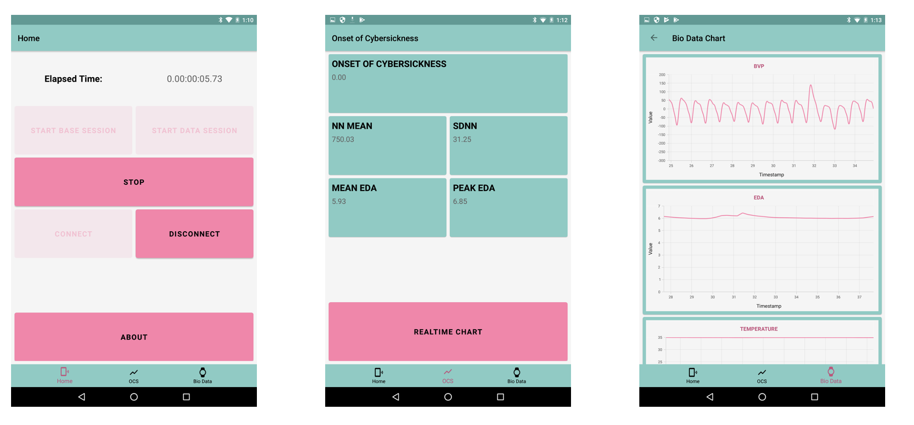

# Release Notes

**What you should know:** Motion sickness afflicts many users when in Virtual Reality. Known also as cybersickness, there are a number of theories as to why the uncomfortableness occurs.

Here are a couple of examples of succinct overviews from products with really great docs:

> * Sensory Conflict theory.
>   * a mismatch of information between vision and vestibular systems.
> * Vection.
>   * an illusion about being in motion; e.g. sitting on a stationary train while observing an adjacent train suddenly moving.
> * Poison theory
>   * symptoms in the stomach leading to vomiting
> * Stability theory
>   * discomfort occurs by unnatural posture during a VR activity.

Research has shown that “_Physiological indicators such as heart rate, respiration rate, galvanic skin response (GSR) or EDA, electrogastrogram (EGG), and skin pallor, and even temperature have all been shown to be related to or predictive of cybersickness_.” [Article available online.](https://daneshyari.com/article/preview/537855.pdf)

> At iVERG we have leveraged the research to create a patented application to predict the onset of cybersickness during your Virtual Reality experience. This means that you will be alerted to the possibility of suffering from cybersickness **before** you even feel uncomfortable.

> An Empatica sensor bracelet transmits secure biodata wirelessly to Cybatica.
>
> Once a threshold value has been reached, determined by our patented cybersickness application, you will be alerted and advised to terminate your Virtual Reality experience.

### Cybatica in action

**Do you have 2 minutes?** Check out a video overview of Cybatica:


Cybatica in action


Thorough physiological data is available by tapping on the interface options.

### Learn more about physiological data.

There are 3 options to view.


* Option 1: you can start and stop the data recording, and view elapsed time using Cybatica.
* Option 2: numerical values of NN MEAN, SDNN, MEAN EDA, PEAK EDA and OCS are displayed.
* Option 3: Real-time data graphs of BVP, EDA and TEMPERATURE are displayed


\* _To learn more about these values, visit our medical information page._

As more users enter the VR metaverse, Cybatica gives peace of mind in maintaining a comfortable experience.

Your body knows when it’s had enough. Cybatica is the friendly reminder to stop.
